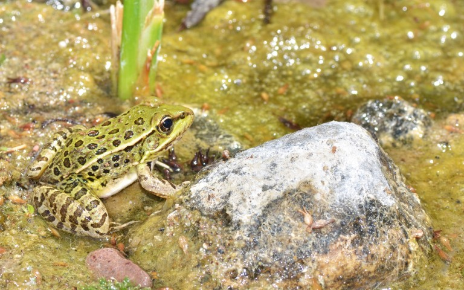

```{r setup, include=FALSE}
knitr::opts_chunk$set(echo = TRUE)
library(tidyverse)
library(knitr)
library(ggplot2)
library(patchwork)
suppressPackageStartupMessages(library(gridExtra))
library(DHARMa) # flexible model diagnostics
library(emmeans) 
library(lme4) # for mixed-effects models
library(lmerTest)
NatParkData<-read_csv("CHYTRID_DATA_2023/National_Park_Data.csv")
ChytridAmpData<-read_csv("CHYTRID_DATA_2023/Chytrid_Amphibian_Data.csv")
```

# Introduction

<p>Chytridiomycosis is a worldwide infectious disease that affects amphibians, and it is caused by the chytrid fungus known as Batrachochytrium dendrobatidis. This fungus has the potential to cause occasional deaths in specific amphibian populations, sometimes leading to total mortality. An experiment conducted by @berger1998chytridiomycosis revealed that the fungus infiltrated the surface layers of the frog's skin, causing harm to the outer keratin layer and resulting in a 100% mortality rate within three weeks. Additionally, in 1997, scientists also observed rainforest frogs succumbing to chytridiomycosis during an outbreak in Panama, confirming that this disease was responsible for widespread declines of some amphibian population globally (@berger1998chytridiomycosis). Chytridiomycosis has established itself as an endemic presence in many regions, typically with a prevalence exceeding 5%, and it is prone to seasonal disease outbreaks (@article). In Australia, this fungus has been directly linked to the extinction of a minimum of four species and the significant reduction in population for at least 10 others, including the waterfall frog (Litoria nannotis), common mistfrog (Litoria rheocola), spotted tree frog (Litoria spenceri), and lace-eyed tree frog (Nycitmystes dayi).</p>

<p>

<center>

{style="width:75%"}

</center>

</p>

<p>In this report, we will provide a statistical model and analysis results associated with Chytrid fungus in three species of amphibian across 15 National Parks in QLD's Wet Tropics Bioregion. We then propose some recommendations aimed at mitigating the risks to native amphibian species in their National Park estate.</p>

# Materials

<p>Two datasets were used to investigate how to manage threats to native amphibian species in their National Park estate. The first dataset compiled by QLD NPS from desktop analyses and previous amphibian and plant surveys. It consists of 15 National Parks, 6 attributes. The second dataset provides data on the incidence of Chytrid fungus in three species of amphibian, collected by QLD NPS in summer 2021 across 15 national parks. The dataset comprises of 255 objects and 7 attributes. Each subject represents one creek. A total of five creeks were sampled per National Park. There are no missing values in both of datasets. A detailed attributes description for datasets are given in Table 1 and Table 2.</p>

```{r, echo=FALSE}
table1<-data.frame("Variables" = c("NP", "VPD", "NP_area_1000_ha", "visit_rate_1000_per_yr", "frog_spp_richness", "plant_spp_richness"),
                   "Description" = c("Code for each of the 15 National Parks (NPs) sampled", "Mean annual Vapour Pressure Deficit (VPD; how dry the atmosphere is; higher is drier) for each NP", "The area of the NP (in thousands of hectares)", "Average number of visitors per year in thousands", "Number of amphibian species recorded in each NP during surveys conducted between 2010 and 2020","Number of plant species recorded in each NP during suverys conducted between 2010 and 2020"),
                   "Type" = c("Nominal","Numeric","Numeric","Numeric","Numeric","Numeric"))
knitr::kable(table1, caption = "Table 1. National Park Data")
```

```{r, echo=FALSE}
table1<-data.frame("Variables" = c("NP", "creek_id", "track_density", "pop_density", "species", "n_frogs_sampled", "n_infected"),
                   "Description" = c("Code for each of the 15 National Parks (NPs) sampled", "The ID number for each creek sampled for frogs and toads in each NP", "The density of walking tracks within a 500m radius of each creek sampling site", "The estimated density of the frog/toad population in each sampled creek", "The species of frog or toad. These are Taudactylus acutirostris, Rhinella marina and Taudactylus rheophilus", "The number of frogs of each species sampled in each creek","The number of sampled frogs/toads that had visible signs of Chytrid infection"),
                   "Type" = c("Nominal","Nominal","Numeric","Numeric","Nominal","Numeric","Numeric"))
knitr::kable(table1, caption = "Table 2. Chytrid Amphibian Data")
```

# Data analysis

## Exploratory data analysis

Summarize data

-   National Park Data

```{r}
NatParkData$NP<-factor(NatParkData$NP)
summary(NatParkData)
```

-   Chytrid Chytrid Amphibian Data

```{r}
ChytridAmpData$NP<-factor(ChytridAmpData$NP)
ChytridAmpData$creek_id<-factor(ChytridAmpData$creek_id)
ChytridAmpData$species<-factor(ChytridAmpData$species, levels=c("Taudactylus acutirostris","Taudactylus rheophilus","Rhinella marina"))
summary(ChytridAmpData)
```

<p>First, take a look into Chytrid Amphibian Data. We calculate propotion of normal frogs in each creak.</p>

```{r}
ChytridAmpData$normal_frogs_prop<-(ChytridAmpData$n_frogs_sampled - ChytridAmpData$n_infected)/ChytridAmpData$n_frogs_sampled
```

Let's draw some histograms.

```{r, echo=F, fig.align="center", fig.width=8, fig.height=4, fig.cap="Figure. Histogram of (a) the number of frogs of each species sampled in each creek, (b) the number of sampled frogs/toads that had visible signs of Chytrid infection and (c) the propotion of healthy(normal) sampled frogs/toads"}
p1<-ggplot(ChytridAmpData, aes(x=n_frogs_sampled)) + 
  geom_histogram(color="black", fill="white", bins=10) +
  ggtitle("(a)") +
  theme(plot.title = element_text(hjust = 0.5, size = 8))
p2<-ggplot(ChytridAmpData, aes(x=n_infected)) + 
  geom_histogram(color="black", fill="white", bins=10)+
  ggtitle("(b)")+
  theme(plot.title = element_text(hjust = 0.5, size = 8))
p3<-ggplot(ChytridAmpData, aes(x=normal_frogs_prop)) + 
  geom_histogram(color="black", fill="white", bins=10)+
  ggtitle("(c)")+
  theme(plot.title = element_text(hjust = 0.5, size = 8))

grid.arrange(p1,p2,p3,ncol = 3, nrow = 1)
```

We notice that these distributions are not normal.

```{r, echo=F, fig.align="center", fig.cap="Figure. Boxplot (a) number of frogs sampled in three species and (b) number of sampled frogs/toads that had visible signs of Chytrid infection in three species."}
p4<-ggplot(ChytridAmpData, aes(x=species, y=n_frogs_sampled, fill=species)) + 
  geom_boxplot()+
  scale_fill_manual(values=c("#7C8483","#60B2E5","#53F4FF"))+
  ylab("Number of frogs in each creek")+
  xlab("(a)")+
  theme(axis.text.x=element_blank())

p5<-ggplot(ChytridAmpData, aes(x=species, y=n_infected, fill=species)) + 
  geom_boxplot()+
  scale_fill_manual(values=c("#7C8483","#60B2E5","#53F4FF"))+
  ylab("Number of infected sampled frogs/toads")+
  xlab("(b)")+
  theme(axis.text.x=element_blank())

combined <- p4 + p5 & theme(legend.position = "bottom")
combined + plot_layout(guides = "collect")
```

<p>From these plots, it's evident that *Rhinella marina* has the highest population. In contrast, *Taudactylus acutirostris* has the smallest number of frogs, and interestingly, they also exhibit the lowest number of infected individuals. *Taudactylus rheophilus*, however, has the highest number of infected individuals among the species.</p>

<p>Simultaneously, we aim to examine whether there is any interaction between the estimated density of the frog/toad population and the proportion of healthy frogs within each surveyed creek.</p>

```{r, echo=F, fig.align="center", fig.width=8, fig.height=4, fig.cap="Figure. Scatterplot of healthy(normal) frogs propotion relative to population density among three species."}

ggplot(ChytridAmpData, aes(x=pop_density, y=normal_frogs_prop, color=species)) + 
  geom_point(size=2) +
  scale_color_manual(values=c("#7C8483","#60B2E5","#53F4FF"))+
  theme_minimal() +
  theme(legend.background = element_rect(linetype="solid", 
                                         colour ="#423E3B"))
```

<p>The figure above shows the effect of the proportion of healthy frogs on population density depends on which species they belong to.</p>

## Models

<p>Rather than utilizing a pre-calculated proportion as the response variable in our analysis, it would be more suitable to create a new response variable. To do this, we will establish a variable that represents the count of healthy frogs.</p>

```{r}
ChytridAmpData$n_no_infected<-ChytridAmpData$n_frogs_sampled - ChytridAmpData$n_infected

```

<p>In this analysis, our primary interest lies in understanding the number of healthy frogs, but it's essential to factor in the total number of frogs sampled in each creek as well. Consequently, we will employ a generalized linear model (GLM) for this analysis. The response variable is not a single variable; rather, it comprises a combination of 'n_infected' and 'n_no_infected' to form a comprehensive response variable.</p>

```{r}
ChytridAmp_glm_1 <- glm(cbind(n_infected, n_no_infected) ~ track_density + pop_density + species + NP, family="binomial", data = ChytridAmpData)
testDispersion(simulateResiduals(ChytridAmp_glm_1))
```

In this case, the model is very overdispersed. We "mop up" the overdispersion using a random effect which assumes a normal distribution. To do that, we will create a ID column (a unique number for each row of data).

```{r}
ChytridAmpData$ID = c(1:dim(ChytridAmpData)[1])
ChytridAmp_glm_2 <- suppressWarnings(glmer(cbind(n_infected, n_no_infected) ~ track_density + pop_density + species + NP + (1|ID), family="binomial", data = ChytridAmpData))
testDispersion(simulateResiduals(ChytridAmp_glm_2))
summary(ChytridAmp_glm_2)
```

Now, let's delve deeper into the dataset. The data exhibits a specific structure where each National Park (NP) consists of five creeks. Given that creeks in our NPs differ systematically across each NP, but we don't want to explicitly estimate differences for each NP, we could consider "partially" pooling site observations together in a mixed-effects model.

```{r}
ChytridAmp_glm_3 <- glmer(cbind(n_infected, n_no_infected) ~ track_density + pop_density + species + (1|ID) + (1|NP), family="binomial", data = ChytridAmpData)
testDispersion(simulateResiduals(ChytridAmp_glm_3))
summary(ChytridAmp_glm_3)
```

Based on the model presented above, it's evident that there are strong correlations between population density and species (Correlation of Fixed Effects). As a result, we aim to assess the model's performance when excluding the population density attribute.

```{r}
ChytridAmp_glm_4 <- glmer(cbind(n_infected, n_no_infected) ~ track_density + species + (1|ID) + (1|NP), family="binomial", data = ChytridAmpData)
testDispersion(simulateResiduals(ChytridAmp_glm_4))
summary(ChytridAmp_glm_4)
```

The output section outlines the random effects estimates for this model, which encompass two random effects: rows within the data and creeks within National Parks. Following that, the output furnishes estimates for the fixed effects, with Taudactylus acutirostris being designated as the reference category.

After removing the 'pop_density' variable, the coefficients for all species exhibit substantial reductions in significance, though they remain higher than their 'track_density.' Notably, only Taudactylus rheophilus maintains a significant difference when compared to Taudactylus acutirostris. We intend to explore "pairwise" comparisons between species.

```{r}
emmeans(object = ChytridAmp_glm_4, specs = pairwise~species)
plot(emmeans(ChytridAmp_glm_4, ~species, type = "response"), horizontal=F)
```

When examining random effects, we can compute the proportion of variance explained, which helps us determine the significance of this effect.

```{r}
0.6106/(0.6106 + 0.7082)
```

So, we can see that 46% of the total variance of random effects is attributed to the NPs.

Let's look at the National Park Data.

```{r, echo=FALSE, fig.height=8, fig.width=6}
par(mfrow = c(2, 1))                   ## Sets up space for two plots (2 rows, 1 column)
hist(NatParkData$frog_spp_richness, breaks=5)
hist(log(NatParkData$frog_spp_richness), breaks=5)
```
We use log(frog_spp_richness) as response variable in this model.

```{r}
NatParkData_lm<-lm(log(frog_spp_richness) ~ VPD + NP_area_1000_ha + visit_rate_1000_per_yr + plant_spp_richness, data = NatParkData)
plot(simulateResiduals(NatParkData_lm))
summary(NatParkData_lm)
```

We can see from the figure above that most of variables are not significant, only NP_area_1000_ha and visit_rate_1000_per_yr are slightly significant(<0.1). Beside that we also want to examine whether any correlation between these variables and richness of frogs.

```{r, echo=FALSE, fig.cap="Figure. Heatmap of National Park data variables"}
suppressPackageStartupMessages(library(reshape2))
modifiedNatParkData <- NatParkData %>% select(!NP) 
cormat <- round(cor(modifiedNatParkData),2)
meltedCormat <- melt(cormat)
ggplot(data = meltedCormat, aes(x=Var1, y=Var2, fill=value)) + 
  geom_tile() +
  theme(axis.text.x = element_text(angle = 25, vjust = 0.6),
        axis.title = element_blank()) +
  geom_text(aes(label = value), color = "white", size = 4)
  
```

The heatmap reveals a positive correlation between the frog population and the size of the National Park (NP). Additionally, there is a slight negative correlation between the frog population and the annual number of visitors. Furthermore, upon examining the proportion of healthy frogs within the Chytrid Amphibian dataset, it's apparent that National Parks C, H, and D, which receive the highest number of visitors, exhibit relatively lower proportions of healthy frogs.

```{r, echo=FALSE, fig.cap="Figure. Propotion of healthy(normal) frogs in 15 National Parks"}
ggplot(ChytridAmpData, aes(x=NP, y=normal_frogs_prop, fill=NP)) + 
  geom_boxplot()+
  xlab("")+
  ylab("Propotion of healthy(normal) frogs in each National Park")
```

# Discussion and Recommendations

Based on our comprehensive analysis, it is evident that distinct strategies should be tailored for different species. Notably, Taudactylus rheophilus stands out as the species at the highest risk. For this species, we recommend a combination of short-term and long-term measures.
In the short term, swift action is essential. Implementing quarantine protocols at park entrances to prevent potential carriers of the fungus from entering the park, such as contaminated equipment or clothing, can be enacted quickly, resulting in immediate impact. Simultaneously, for long-term disease management, we should consider measures such as translocation and reintroduction, which are common strategies for preserving this species. Within the broader category of "conservation translocations", @scheele2021conservation encompass the following actions: (a) reintroduction, which involves releasing animals into regions from which they have disappeared, with the aim of establishing a population, (b) population augmentation, where animals are introduced into areas where similar species already exist, in order to bolster the overall population's viability, (c) assisted colonization, a strategy in which animals are introduced beyond their native range to establish a new population and (d) mitigation translocation, a practice in which animals are relocated from habitat that is scheduled for destruction and released into an alternative location. Additionally, in the case of translocations involving amphibians threatened by Batrachochytrium dendrobatidis (Bd), there is frequently a requirement for concurrent monitoring of Bd dynamics. Gathering data on Bd dynamics can aid in distinguishing mortality attributed to Bd from other sources of mortality.

Using antifungals directly on vulnerable hosts has not proven effective as a long-term strategy for combating Chytrid fungus in its natural environment. Nevertheless, in a controlled environment with a single amphibian host species, a combination of antifungal treatments for individual frogs and environmental chemical treatments successfully eradicated Chytrid fungus, and this elimination was sustained for multiple years (@bosch2015successful). These results indicate that employing fungicides in the environment could serve as a feasible, economical, easily executable, and widely adaptable approach in our specific scenarios. This conclusion is supported by the observation that each National Park contains only a single species, as indicated by the data.

Furthermore, the analysis indicates that the number of park visitors may influence the diversity of frog species and the number of healthy frogs. We propose implementing measures, such as visitor education, to inform them about Chytrid fungus and emphasize the importance of responsible conduct within the park.

Regarding the National Park data, it's worth noting that the dataset comprises a limited sample size with only 15 subjects. Drawing definitive conclusions from such a small dataset can be challenging.


# References {.unnumbered}

::: {#refs}
:::
